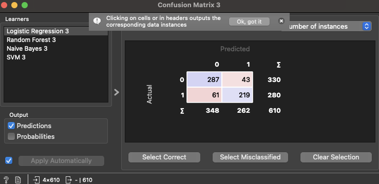

# YMT5270 Ara Sınav Projesi: Orange ile Veri Analizi ve Makine Öğrenmesi

## Öğrenci Bilgileri
- **Ad Soyad**: Mert İncidelen
- **Öğrenci Numarası**: 242137210
- **E-posta**: mincidelen@firat.edu.tr

## Proje Özeti
Bu projede UCI Machine Learning Repository üzerinden alınan Heart Disease veri seti kullanılarak bireylerde kalp hastalığı riskinin sınıflandırılması gerçekleştirilmiştir . Orange platformu ile veri setinin analizi ve farklı ön işlemler ile farklı modellerin eğitimi gerçekleştirilerek sonuçlar çeşitli metriklerle karşılaştırılmıştur. Çalışma kapsamında önce veri ön işleme adımları uygulanmıştır. Veri setinde %0.2 oranında eksik değer olduğu tespit edilmiş ve bu değerler “Impute” ile ortalama/ en sık değer yöntemleriyle tamamlanmıştır. Sayısal öznitelikler normalize edilerek 0 ile 1 aralığına dönüştürülmüştür. Aykırı değerler Box Plot ve Scatter Plot görselleştirmeleri ile analiz edilmiş, modelleme sürecine dahil edilmiştir. Makine öğrenmesi aşamasında Logistic Regression, Random Forest, Naive Bayes ve SVM modelleri uygulanmıştır. Modeller %80 eğitim – %20 test oranında ve Stratified Random Sampling yöntemiyle değerlendirilmiştir. “Test & Score” kullanılarak modellerin karşılaştırması yapılmış ve sonuçlar AUC, Accuracy, Precision, Recall, F1 Score ve MCC gibi farklı metriklerle ölçülmüştür. Her modelin başarı oranı ayrıca ROC eğrisi ile görselleştirilmiş ve sınıflandırma performansı karşıtlık matrisi üzerinden detaylı olarak değerlendirilmiştir.

## Veri Seti
### Veri Seti Bilgileri
- **Veri Seti Adı**: Heart Disease
- **Kaynak**: [Uci Repository - Heart Disease Veri Seti](https://archive.ics.uci.edu/dataset/45/heart+disease)
- **Veri Seti Boyutu**: *303 Satır, 13 Sütun*

### Veri Seti Tanımı
Veri Seti: Hastaların yaşı, cinsiyeti, göğüs ağrısı tipi, dinlenme sırasında kan basıncı, kolesterol düzeyi, kalp atış hızı gibi farklı klinik ölçümlerine dayanarak kalp hastalığı tanısı 0 (yok) ve 1 (var) sınıfklarını içermektedir.

### Öznitelik Açıklamaları
| Öznitelik Adı | Veri Tipi | Açıklama | Örnek Değer |
|---------------|-----------|----------|-------------|
| age | Sayısal | Hastanın yaşı | 63 |
| gender | Kategorik | Cinsiyeti | male |
| chest pain | Kategorik | Göğüs ağrısı tipi (asymptomatic, typical ang, non-anginal, atypical ang) | typical ang |
| rest SBP | Sayısal | İDinlenme sırasındaki sistolik kan basıncı | 145 |
| cholestrol | Sayısal | Serum kolesterol düzeyi | 233 |
| fasting blood sugar | Kategorik | Açlık kan şekeri 120 mg/dl’den yüksek mi? | 1 |
| rest ECG | Kategorik | Dinlenme elektrokardiyografi sonuçları | left vent hypertrophy |
| max HR | Sayısal | Egzersiz sırasında ulaşılan maksimum kalp atış hızı | 150 |
| exerc ind ang | Kategorik | Egzersize bağlı anjina (0 = Hayır, 1 = Evet) | 0 |
| ST by exercise | Sayısal | İlgili açıklama | 2.3 |
| slope peak exc ST | Kategorik | Egzersize bağlı ST segment depresyonu | downsloping |
| major vessels colored | Sayısal | görüntülenen büyük damar sayısı | 0 |
| thal | Kategorik | Talasemi tipi (normal, reversible, fixed defect) | fixed defect |
| diameter narrowing | Kategorik | Hedef değişken: damar daralması var mı? (0 / 1) | 0 |

## Keşifsel Veri Analizi (Explanatory Data Analysis - EDA)
### Temel İstatistikler

### Veri Ön İşleme

- Impute widget ile eksik veriler, sayısal için ortalama, kategorik için en sık değer ile dolduruldu.
-  Box Plot ve Scatter Plot kullanılarak aykırı değerler belirlendi.
- Tüm sayısal değişkenler 0 ile 1 aralığına ölçeklendirildi.
- Orange kategorik değişkenleri otomatik olarak işlendi.

### Görselleştirmeler

#### Görselleştirme 1: [Feature Statistics]

*Öznitelikler kalp hastalığı sınıflarına (0 ve 1) göre nasıl dağıldığını göstererek sınıflandırma açısından etkili olabilecek değişkenleri ortaya koymaktadır. Özellikle ST by exercise, chest pain ve thal gibi öznitelikler sınıflar arasında belirgin farklılık göstermektedir. Veri seti genel olarak dengeli ve eksik veri oranı oldukça düşüktür.*

#### Görselleştirme 2: [değişkenlerin kalp hastalığına göre dağılımı]

*Erkek bireylerde kalp hastalığı görülme oranı kadınlara göre daha fazladır. Kadınlarda hastalık görülme oranı düşük kalırken, hastalığı olmayan grubun büyük çoğunluğunu da erkekler oluşturmaktadır. Diğer değişkenlere de hastalık dağılımı için bakılabilmektedir.*

### Öznitelik İlişkileri

## Makine Öğrenmesi Uygulaması
### Kullanılan Yöntem
Bu projede hedef değişken olarak seçtiğim diameter narrowing ikili kategorik bir değişken (0:hastalık yok, 1: hastalık var) olduğundan dolayı sınıflandırma yöntemi tercih edilmiştir.

### Modeller ve Parametreler

Projede dört farklı sınıflandırma modeli uygulanmıştır: Logistic Regression (C=1), Random Forest(Ağaç=15), Naive Bayes ve SVM (C=1, epsilon = 0,1). Farklı ön işleme adımları ile (eksik veri tamamlama ve 0-1 normalizasyonu) modeller verilen parametrelerle çalıştırılmıştır. Test işlemleri %80 eğitim – %20 test oranıyla, stratified random sampling yöntemi kullanılarak yapılmıştır.

### Model Değerlendirmesi
(Tüm ön işlemlerin uygulandığı sonuçlar)

AUC (Area Under Curve): ROC eğrisi altındaki alan. 1’e ne kadar yakınsa model o kadar iyi
CA (Classification Accuracy): Doğru tahmin oranı
Precision: Pozitif tahminlerin ne kadarının doğru olduğu
Recall (Sensitivity): Gerçek pozitiflerin ne kadarının doğru tahmin edildiği
F1 Score: Precision ve Recall’un dengeli ortalaması
MCC (Matthews Correlation Coefficient): Sınıf dengesini de hesaba katarak genel başarıyı gösteren metriktir

### Sonuçların Yorumlanması
(Tüm ön işlemlerin uygulandığı akış için sonuçlar)
Naive Bayes, en yüksek doğruluk (0,836), F1 skoru (0,836) ve MCC (0,669) ile en başarılı model olmuştur. Naive BayeS küçük ve dengeli veri setlerinde hızlı ve tutarlı sonuçlar üretmesiyle öne çıkmaktadır. Logistic Regression, AUC (0,913) değeriyle sınıflar arasında ayrımı başarılı bir şekilde yapmıştır. Ayrıca Precision, Recall ve Accuracy skorları aynı çıkmıştır, bu da modelin pozitif ve negatif sınıfları dengeli bir biçimde ayırt ettiğini göstermektedir. Random Forest ise genelde güçlü bir model olmasına rağmen bu veri setinde AUC (0.881) ve MCC (0.596) gibi metriklerde daha düşük performans göstermiştir. Bu durum, modelin karmaşık yapısına rağmen küçük veri setlerinde aşırı öğrenme eğilimi gösterebilmesindendir. SVM (Support Vector Machine) modeli de kabul edilebilir iyi bir performans sergilemiştir (CA: 0.813, AUC: 0.884).

## Orange İş Akışı
Bu projede Orange platformu kullanılarak üç ayrı iş akışı oluşturulmuş ve veri ön işleme adımlarının model performansına etkisi de incelenmiştir. İlk iş akışında veri seti üzerinde herhangi bir ön işleme yapılmadan doğrudan analiz gerçekleştirilmiştir. Data Info, Feature Statistics, Box Plot ve Distributions gibi araçlarla verinin genel yapısı, aykırı değerler ve sınıf dağılımları incelenmiş, ardından dört farklı sınıflandırma algoritması (Logistic Regression, Random Forest, Naive Bayes, SVM) kullanılarak modeller eğitilmiştir. Her model Test & Score, ROC Analysis ve Confusion Matrix widget’ları ile değerlendirilmiş, başarı metrikleri karşılaştırılmıştır. İkinci iş akışında, eksik veriler Impute widget’ı aracılığıyla ortalama ve mod kullanılarak tamamlanmış ve aynı analiz süreci tekrarlanmıştır. Bu sayede eksik verilerin doldurulmasının modellerin doğruluğuna etkisi gözlemlenmiştir. Üçüncü ve iş akışında ise önce eksik veriler doldurulmuş, ardından tüm sayısal öznitelikler Normalize Features kullanılarak 0-1 aralığına ölçeklenmiştir. Her üç akışta da modeller eğitilmiş, test edilerek Predictions, ROC Analysis ve Confusion Matrix ile analiz edilmiştir. Ek olarak ön işlemler (eksik veri, normalizasyon) 4. iş akışında farklı bir yoldan gerçekleştirilmiştir.

## Sonuç ve Öneriler
Projede kalp hastalığı tahmini için UCI Heart Disease veri seti üzerinde Orange Data Mining platformu kullanılarak sınıflandırma odaklı bir analiz gerçekleştirilmiştir. Farklı ön işleme senaryoları (ham veri, eksik veri tamamlanmış veri, eksik veri tamamlanıp normalize edilmiş veri) uygulanmış ve bu senaryolar altında dört makine öğrenmesi modeli (Logistic Regression, Random Forest, Naive Bayes, SVM) ile eğitim ve test işlemleri yapılmıştır. En başarılı sonuçlar, hem doğruluk hem de AUC açısından Naive Bayes ve Logistic Regression modelleri ile elde edilmiştir. Ayrıca, ROC eğrileri ve Confusion Matrix değerlendirmeleri ile modellerin sınıflandırma başarısı detaylı şekilde karşılaştırılmıştır. Gelecek çalışmalar için öneri olarak daha büyük ve güncel veri setlerinin kullanılması, öznitelik seçimi yöntemlerinin entegrasyonu ve hiperparametre ayarlamaları ile modellerin daha da optimize edilmesi gerçekleştirilebilir. Ayrıca XGBoost, LightGBM veya derin öğrenme tabanlı yaklaşımlar gibi daha gelişmiş algoritmalar da denenerek daha başarılı sonuçlar elde edilebilir.

## Kaynaklar

1. [https://www.youtube.com/@OrangeDataMining](https://www.youtube.com/@OrangeDataMining)

## Ekler
### Orange Proje Dosyası
 [242137210_incidelen.ows](project/242137210_incidelen.ows)

### Veri Seti Dosyası veya Bağlantısı
[Veri Seti Bağlantısı](https://archive.ics.uci.edu/dataset/45/heart+disease)
